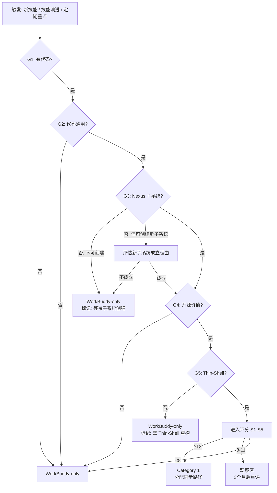

# Hermes-Nexus 迁移方案 & Hermes Agent 全能力升级 SOP

> **文档类型**: CTO 审批提案
> **版本**: v3.0 (新增动态评估框架 — 3/24 不再是静态分类，而是可重复执行的评估流程)
> **日期**: 2026-05-24
> **状态**: 待审批
> **关联**: Phase 1 ✅ 已完成 (遗留物清理) — Phase 2 (迁移方案) — Phase 3 (全能力升级 SOP)

---

## 修订说明 (v3.0)

**v2.0 → v3.0 新增**:
1. **动态评估框架 (3.0.5)** — 将「哪些能力加入 Category 1 代码同步」从**一次性判断**升级为**可重复执行的门禁+评分模型**，含 5 道门禁 + 5 维评分 + 正反案例演练
2. **升级决策树更新 (3.2)** — 新增「重新评估」分支：当技能从纯 Prompt 演进为含代码、或新建 Nexus 子系统时，触发再评估
3. **重评估节奏 (3.5)** — 定义了事件驱动 + 周期性两种触发机制，确保分类不会成为「过期快照」

**v2.0 已有 (保留)**:
- Hermes Agent 能力全景矩阵 — 24 个技能，6 大分类
- 完整代码映射表 — 本地脚本 ↔ Hermes-Nexus 7 个子系统
- 6 条升级子路径 (A1-A3: 代码同步 / B: 白泽演进 / C-F: WorkBuddy-only)
- 白皮书自动同步链路 + 扩展版升级决策树 + 逐对 diff 数据

---

## Phase 2: Hermes-Nexus 物理迁移方案

### 1. 全系统耦合扫描结论

对 `~/OpenSource/hermes-nexus` 进行了 **25 个维度**的全量扫描：

| # | 扫描维度 | 结果 | 风险 |
|---|---------|------|------|
| 1 | Shell 配置 (~/.zshrc, ~/.zprofile 等) | ✅ 零引用 | 无 |
| 2 | LaunchAgents (launchd plist) | ✅ 零引用 Desktop 路径 | 无 |
| 3 | LaunchDaemons | ✅ 无 plist | 无 |
| 4 | Crontab | ✅ 零引用 | 无 |
| 5 | WorkBuddy Automations (workbuddy.db) | ✅ cwds 无 Desktop | 无 |
| 6 | Skills (~/.workbuddy/skills/) | ✅ 零 Desktop 路径引用 | 无 |
| 7 | Scripts (~/.workbuddy/scripts/) | ✅ 零引用 | 无 |
| 8 | MCP 配置 (mcp.json) | ✅ 零引用 | 无 |
| 9 | IDE/Editor 配置 | ✅ 零引用 | 无 |
| 10 | Hermes-Nexus 仓库内部代码 (.py/.sh) | ✅ P5 已修复为动态 PROJECT_ROOT | 无 |
| 11 | Hermes-Nexus .gitignore/.env | ✅ 无硬编码 | 无 |
| 12 | Hermes-Nexus Git remote | ✅ SSH remote，与本地路径无关 | 无 |
| 13 | SOUL.md / USER.md | ✅ 零引用 | 无 |
| 14 | ~/.workbuddy/memory/MEMORY.md | ⚠️ 含历史路径记录 | **仅文档性** |
| 15 | WorkBuddy 项目 memory/*.md | ⚠️ 含历史路径记录 | **仅文档性** |
| 16 | Governance Blueprint | ⚠️ 含路径拓扑图 | **需更新** |
| 17 | Artifact Index | ⚠️ 含旧 URI 引用 | **自动过期** |
| 18 | 上游监控脚本 | ✅ 监控 GitHub API，与本地无关 | 无 |
| 19 | Hermes Agent 白皮书 | ✅ 零 Desktop 引用 | 无 |
| 20 | WorkBuddy 白皮书 | ✅ 零 Desktop 引用 | 无 |
| 21 | 全局 Git 配置 | ✅ 零引用 | 无 |

**结论: 风险等级 = 🟢 低。** P5 的动态 PROJECT_ROOT 修复已消除唯一硬耦合。迁移实质上是 `mv` + 文档更新 + 验证。

### 2. 新位置方案

#### 核心考量

1. **不在 WorkBuddy 下**: Hermes-Nexus 是独立开源项目，有自己的 Git 生命周期
2. **需要扩展性**: 未来可能有项目 B、C、D 并列
3. **可 iCloud 同步**: 利用 iCloud Drive 备份 + 跨设备访问
4. **语义清晰**: 目录名自我描述，一眼可知用途

#### 方案对比

| 维度 | 方案 A: `~/Documents/Repos/` | 方案 B: `~/Repos/` | 方案 C: `~/OpenSource/` |
|------|---------------------------|-------------------|----------------------------------|
| iCloud 同步 | ✅ `~/Documents` 默认同步 | ❌ 不同步 | ✅ 同步 |
| 语义清晰度 | 中等 ("Repos" 偏技术) | 中等 | 高 ("OpenSource" 自描述) |
| 扩展性 | ✅ `hermes-nexus/`, `project-b/`, ... | ✅ 同左 | ✅ 同左 |
| 与现有目录共存 | ⚠️ `~/Documents/` 已有文件混杂 | ✅ 根级干净 | ⚠️ 同 A |
| 跨设备访问 | ✅ iCloud 自动同步 | ❌ 需手动 | ✅ 自动 |
| Finder 侧栏可见 | ✅ Documents 有系统快捷 | ❌ 需自定义 | ✅ 同 A |

#### **推荐: 方案 C — `~/OpenSource/`**

理由:
- "OpenSource" 一词自我描述，对非技术背景者也清晰
- 位于 iCloud 同步的 `~/Documents/` 下，自动备份 + 跨 Mac 可用
- 扩展性: 未来所有开源项目平铺在此

目标结构:
```
~/OpenSource/
├── hermes-nexus/          ← ~/OpenSource/hermes-nexus/ 迁移至此
├── project-b/             ← 未来
├── project-c/             ← 未来
└── project-d/             ← 未来
```

### 3. 迁移步骤（精细版）

#### Step 0: 前置检查 (只读，零风险)

```bash
# 0a. 确认源仓库状态干净
cd ~/OpenSource/hermes-nexus && git status --porcelain
# 期望: 空输出 (无未提交变更)

# 0b. 确认 remote 正确
git remote -v
# 期望: origin  git@github.com:solarspring13-spec/Hermes-Nexus.git (fetch/push)

# 0c. 确认最新 tag
git tag -l | tail -3
# 期望: v0.2.0-beta 存在

# 0d. 记录当前 commit SHA (用于回滚)
git rev-parse HEAD > /tmp/hermes-nexus-pre-migration-sha.txt
```

#### Step 1: 创建目标结构

```bash
mkdir -p ~/OpenSource
```

#### Step 2: 执行物理迁移

```bash
mv ~/OpenSource/hermes-nexus ~/OpenSource/hermes-nexus
```

#### Step 3: 验证 Gate 1 — 仓库完整性

```bash
# 3a. Git 历史完整
cd ~/OpenSource/hermes-nexus && git log --oneline -3
# 期望: 与迁移前一致

# 3b. Remote 未变
git remote -v
# 期望: git@github.com:solarspring13-spec/Hermes-Nexus.git

# 3c. 工作区干净
git status --porcelain
# 期望: 空

# 3d. Tag 保留
git tag -l
# 期望: v0.2.0-beta 等全部保留
```

#### Step 4: 验证 Gate 2 — sync.py 动态路径

```bash
# 4a. 从新路径运行 sync.py --diff
python3 ~/OpenSource/hermes-nexus/.maintainer/sync/sync.py --diff 2>&1 | head -10
# 期望: 正常启动，无 ImportError / FileNotFoundError

# 4b. 验证 PROJECT_ROOT 自动推导正确
python3 -c "
import sys; sys.path.insert(0, '$HOME/OpenSource/hermes-nexus/.maintainer/sync')
import sync
print('PROJECT_ROOT:', sync.PROJECT_ROOT)
"
# 期望: /Users/siriuscyber/OpenSource/hermes-nexus
```

#### Step 5: 验证 Gate 3 — 全系统回归

```bash
# 5a. install.sh 可用性
bash ~/OpenSource/hermes-nexus/install.sh --help 2>&1 | head -5

# 5b. OTA updater
python3 ~/OpenSource/hermes-nexus/memoria_engine/utils/updater.py --check 2>&1 | head -5

# 5c. 验证旧 Desktop 路径已空
ls ~/OpenSource/hermes-nexus 2>&1 | grep -q "No such" && echo "✅ Desktop 已清理"
```

#### Step 6: 文档更新 (需要修改的文件清单)

| 文件 | 变更内容 | 影响 |
|------|---------|------|
| `Hermes-Nexus_Governance_Blueprint.md` | 路径拓扑从 `~/OpenSource/hermes-nexus/` → `~/OpenSource/hermes-nexus/` | 文档引用 |
| `WorkBuddy_Master_Blueprint.md` | 如有引用则更新 | 文档引用 |
| `~/.workbuddy/memory/MEMORY.md` | 追加迁移记录 | 记忆 |
| `2026-05-24.md` (daily log) | 记录迁移操作 | 记忆 |
| `~/.workbuddy/projects/.../artifact-index/*.json` | 自动过期，无需手动处理 | 无 |

#### Step 7: 回滚预案

```bash
# 回滚: 移回 Desktop
mv ~/OpenSource/hermes-nexus ~/OpenSource/hermes-nexus

# 验证
python3 ~/OpenSource/hermes-nexus/.maintainer/sync/sync.py --diff
```

回滚窗口: **7 天**。

---

## Phase 3: Hermes Agent 全能力升级 SOP (v2.0)

### 3.0 Hermes Agent 能力全景矩阵

以下列出全部 **24 个** `agent_created: true` 的 Hermes Agent 子能力，按 6 大分类组织。**关键区分**: 仅 Category 1 (Core Infrastructure) 有代码级映射到 Hermes-Nexus 仓库；其余 5 类均为 WorkBuddy-only。

#### Category 1: Core Hermes Infrastructure (代码 → Hermes-Nexus 同步)

> **这是唯一与开源仓库有代码级映射的能力组。所有升级最终须流转到 Hermes-Nexus GitHub Release。**

| # | 本地 Skill | 脚本数 | Hermes-Nexus 子系统 | 映射文件数 | 同步方向 |
|---|-----------|--------|-------------------|-----------|---------|
| 1 | `enhanced-memory` | 24 py | `memoria_engine/{memory,semantic,daemon,skills,utils,models}` | 24↔24 | **双向** |
| 2 | `hermes-cron` | 2 py | `memoria_engine/cron/` | 2↔2 | **双向** |
| 3 | `hermes-kanban` | 3 py | `memoria_engine/kanban/` | 3↔3 | **双向** |
| 4 | `nudge-review` | 0 | _(enhanced-memory 子功能)_ | N/A | **间接** (via #1) |
| 5 | `hermes-exec` | 0 (骨架) | _(Phase 5 冻结)_ | N/A | **待定** |

**Hermes-Nexus 独有文件 (本地无对应)**:
- `memoria_engine/config.py` — 开源版独立配置
- `memoria_engine/utils/updater.py` — 开源版 OTA 更新器

#### Category 2: 白泽 Ecosystem (白皮书自动同步链)

| # | 本地 Skill | 脚本数 | 性质 | 白皮书同步 |
|---|-----------|--------|------|-----------|
| 6 | `agent-white-paper` (白泽) | 0 | 纯 Prompt 生成器 | 被 #7 自动同步 |
| 7 | `baize-evolution` (司辰官·夜巡) | 10 (9 py + 1 sh) | 自动化管道 | **主动同步者** |

**白泽 Ecosystem 的特殊性**: `baize-evolution` 是「白皮书的守护者」— 每夜自动扫描所有 Skill，检测 SKILL.md ↔ Whitepaper 的漂移，生成审批队列。它不是被同步的对象，而是同步的执行者。白泽 Ecosystem 的升级链路见 [路径 B](#路径-b-白泽-ecosystem-升级-sop)。

#### Category 3: Investment Tools (投资工具 — 纯 Prompt)

| # | 本地 Skill | 脚本数 | 性质 | 升级方式 |
|---|-----------|--------|------|---------|
| 8 | `due-diligence` | 0 | 纯 Prompt 框架 | SKILL.md 迭代 |
| 9 | `investment-memo` | 0 | 纯 Prompt 框架 | SKILL.md 迭代 |
| 10 | `grill-me` | 0 | 纯 Prompt 对抗审查 | SKILL.md 迭代 |
| 11 | `投研大脑` | 0 | Prompt + references | SKILL.md + references 迭代 |
| 12 | `暗夜灯塔` | 0 | Prompt + references + examples | SKILL.md + references 迭代 |

#### Category 4: Productivity Tools (生产力工具 — 纯 Prompt)

| # | 本地 Skill | 脚本数 | 性质 | 升级方式 |
|---|-----------|--------|------|---------|
| 13 | `caveman` | 0 | 纯 Prompt 压缩 | SKILL.md 迭代 |
| 14 | `debug` | 0 | 纯 Prompt 方法论 | SKILL.md 迭代 |
| 15 | `handoff` | 0 | 纯 Prompt 交接 | SKILL.md 迭代 |
| 16 | `switch-role` | 0 | 纯 Prompt 切换 | SKILL.md 迭代 |
| 17 | `weekly-report` | 0 | 纯 Prompt 压缩 | SKILL.md 迭代 |
| 18 | `meeting-transcript` | 0 | 纯 Prompt 转换 | SKILL.md 迭代 |

#### Category 5: Generators & Renderers (生成器 — 部分含代码)

| # | 本地 Skill | 脚本数 | 性质 | 升级方式 |
|---|-----------|--------|------|---------|
| 19 | `meta-agent-generator` (创世架构师) | 0 | Prompt + template | SKILL.md + template 迭代 |
| 20 | `html-report` | 0 | 纯 Prompt 生成器 | SKILL.md 迭代 |
| 21 | `report-renderer` | 4 py + templates | **含代码引擎** | SKILL.md + Python 代码迭代 |
| 22 | `hermes-portable-bootstrap` | 1 sh | Shell 脚本 | SKILL.md + .sh 迭代 |

#### Category 6: Monitoring & Legal (监控与法律)

| # | 本地 Skill | 脚本数 | 性质 | 升级方式 |
|---|-----------|--------|------|---------|
| 23 | `model-ecosystem-patrol` (观象台) | 0 | Prompt + references | SKILL.md + references 迭代 |
| 24 | `lexbridge-legal-counsel` (律合) | 0 | Prompt + references | SKILL.md + references 迭代 |

---

### 3.0.5 动态评估框架：哪些能力应加入代码同步？

> **核心理念**: 当前 3/24 的分类是**评估时点（2026-05-24）的快照**，而非永久判决。随着 Hermes Agent 能力持续演进——技能从纯 Prompt 进化为含代码、上游 nousresearch/hermes-agent 新增模块、Hermes-Nexus 创建新子系统——原分类可能失效。本框架提供一套**可重复执行的门禁+评分模型**，使每次「是否加入 Category 1？」的决策都有方法论支撑，而非仅凭直觉。

#### 为什么需要评估框架

一个典型的场景：

> 今天 `report-renderer` 是 Category 5（4 个 Python 文件，但无 Nexus 子系统映射）。半年后，Hermes-Nexus 新增了 `memoria_engine/render/` 子系统。此时 `report-renderer` 的代码有了明确的映射目标，应被重新评估是否该纳入 Category 1。

**如果分类是永久判决，这个重要的升级机会就会被遗漏。** 评估框架的作用就是捕获这种动态变化。

#### 五道门禁 (G1–G5)

> 门禁是**硬性条件**。任意一道不通过即终止评估，技能归入 WorkBuddy-only。全部通过方可进入评分环节。

| # | 门禁 | 判断标准 | 不通过 → | 示例 |
|---|------|---------|---------|------|
| **G1** | 代码存在性 | 技能是否有 `scripts/*.py` 或 `scripts/*.sh`？ | 纯 Prompt 技能 → WorkBuddy-only | `due-diligence`: 仅 SKILL.md → ❌ 止于 G1 |
| **G2** | 代码通用性 | 代码是**基础设施级**（可跨部署、跨用户复用）还是**领域专属**（绑定单一用户/场景）？ | 领域专属 → WorkBuddy-only | `enhanced-memory`: 记忆引擎，任何 Agent 都需要 → ✅ 通过 |
| **G3** | 子系统映射 | 代码能否映射到 Hermes-Nexus 已有子系统？若无，创建新子系统的理由是否成立？ | 无映射 → WorkBuddy-only（标记：待子系统创建后重评） | `report-renderer`: 当前无 Nexus 渲染子系统 → ❌ 止于 G3（标记重评） |
| **G4** | 开源价值 | 脱离 WorkBuddy 生态后，该代码作为独立开源模块是否有用户价值？ | 仅 WorkBuddy 内有用 → WorkBuddy-only | `baize-evolution`: 深度绑定 WorkBuddy 夜间管道 → ❌ 止于 G4 |
| **G5** | Thin-Shell 成熟度 | 技能是否采用 Thin-Shell 委托模式（SKILL.md 仅为适配层，实际逻辑通过 `python3 -m` 委托到脚本）？ | 紧耦合 → 需先重构再评估 | `enhanced-memory`: SKILL.md 全部 delegate 到 scripts/ → ✅ 通过 |

#### 评分模型（通过门禁后，5 维量化）

> 仅通过全部 5 道门禁的技能进入评分。每维 0–3 分，满分 15。

| 维度 | 权重 | 0 分 | 1 分 | 2 分 | 3 分 |
|------|------|------|------|------|------|
| **S1: 变更频率** | 代码多久变一次？ | 年级 | 半年 | 季度 | 月度或更频 |
| **S2: 下游影响面** | 多少 WorkBuddy 组件依赖它？ | 0 | 1-2 | 3-5 | 6+ |
| **S3: 社区需求** | 开源后独立用户会想要吗？ | 无人需要 | 小众 | 有明确场景 | 广泛需求 |
| **S4: 同步维护成本** | 保持 Nexus ↔ 本地同步难吗？ | 极高（需大量适配） | 较高 | 中等 | 低（sync.py 已覆盖） |
| **S5: 同步基建就绪** | sync.py / CI / 测试是否已覆盖？ | 零基建 | 部分脚本 | 基本就绪 | 完全就绪 |

**判定矩阵**:

| 总分 | 判定 | 行动 |
|------|------|------|
| ≥ 12 | **Category 1 强候选** | 分配升级路径 A1/A2/A3，加入 sync.py 映射 |
| 8–11 | **观察区** | 保留当前分类，3 个月后重评；若 G3 因「无子系统」不通过，优先评估是否创建新子系统 |
| < 8 | **WorkBuddy-only** | 保持当前分类，仅在 G1–G5 条件变化时重评 |

#### 正案例演练：初始 3/24 评估全过程

以下展示 2026-05-24 评估时，三个**通过全部门禁**的技能是如何得出 Category 1 判定的。

##### Case 1: `enhanced-memory` → Category 1 ✅

| 门禁 | 判断 | 依据 |
|------|------|------|
| G1 代码存在性 | ✅ | `scripts/` 下 24 个 .py 文件 |
| G2 代码通用性 | ✅ | 记忆引擎（nudge/索引/压缩/向量/会话状态）——任何 Agent 都需要 |
| G3 子系统映射 | ✅ | 映射到 `memoria_engine/{memory,semantic,daemon,skills,utils,models}` 共 6 个子系统 |
| G4 开源价值 | ✅ | 记忆系统是 Agent 基础设施的「水电煤」，独立开源价值极高 |
| G5 Thin-Shell | ✅ | SKILL.md 所有操作均委托到 `python3 scripts/xxx.py` |

| 评分维度 | 得分 | 依据 |
|---------|------|------|
| S1 变更频率 | 3 | 月度级——upstream releases + 本地迭代 |
| S2 下游影响面 | 3 | SOUL.md 启动协议 + Automations + hermes-cron + hermes-kanban + 20+ 其他 Skill 间接依赖 |
| S3 社区需求 | 3 | 任何自建 Agent 系统都需要记忆管理 |
| S4 同步维护成本 | 2 | sync.py 已覆盖，但 24 文件 × 6 子系统的维护量较大 |
| S5 同步基建 | 2 | sync.py 基本就绪，但 CI / 自动化测试待完善 |

**总分: 13 → Category 1 强候选** ✅

##### Case 2: `hermes-cron` → Category 1 ✅

| 门禁 | 判断 | 依据 |
|------|------|------|
| G1 | ✅ | 2 个 .py |
| G2 | ✅ | 自然语言 Cron 解析 + 调度——通用基础设施 |
| G3 | ✅ | 映射到 `memoria_engine/cron/` |
| G4 | ✅ | 独立 cron 引擎有明确开源价值 |
| G5 | ✅ | SKILL.md → `python3 scripts/cron_parser.py` |

| 维度 | 得分 |
|------|------|
| S1 | 1 (季度级变更) |
| S2 | 2 (Automations + hermes-kanban 依赖) |
| S3 | 2 (有独立场景) |
| S4 | 3 (仅 2 文件，同步成本极低) |
| S5 | 3 (sync.py 已覆盖) |

**总分: 11 → Category 1 候选**（边缘，但因 S4+S5 高分为强信号）

##### Case 3: `hermes-kanban` → Category 1 ✅

| 门禁 | 判断 | 依据 |
|------|------|------|
| G1 | ✅ | 3 个 .py |
| G2 | ✅ | 多 Agent 任务看板——通用 Agent 编排基础设施 |
| G3 | ✅ | 映射到 `memoria_engine/kanban/` |
| G4 | ✅ | Agent 协作看板是热门方向 |
| G5 | ✅ | SKILL.md → `python3 scripts/kanban_*.py` |

| 维度 | 得分 |
|------|------|
| S1 | 1 (季度级变更) |
| S2 | 2 (hermes-cron + multi-agent 编排依赖) |
| S3 | 2 (Agent 看板是独立需求) |
| S4 | 3 (仅 3 文件) |
| S5 | 3 (sync.py 已覆盖) |

**总分: 11 → Category 1 候选**

#### 反案例演练：有代码但未通过门禁的技能

以下展示两个**有代码但止步于某道门禁**的技能，说明为什么它们未被纳入 Category 1，以及未来可能在什么条件下被重新评估。

##### Case 4: `report-renderer` → WorkBuddy-only（止于 G3）⚠️ 标记重评

| 门禁 | 判断 | 依据 |
|------|------|------|
| G1 | ✅ | `L0/render.py`、`L0/asset_bundler.py`、`L0/theme_router.py` 共 4 个 .py + Jinja2 模板 |
| G2 | ✅ | HTML 渲染引擎是通用能力 |
| G3 | ❌ | **Hermes-Nexus 当前无 `memoria_engine/render/` 子系统** |
| — | — | 评估中止于 G3 |

**重评条件**: 当 Hermes-Nexus 创建 `memoria_engine/render/` 子系统后，`report-renderer` 应从 G3 继续评估（G4: 开源价值、G5: Thin-Shell 成熟度）。

**预期结果**（子系统创建后）:
- G4 开源价值: ✅（通用 HTML 渲染引擎有独立价值）
- G5 Thin-Shell: ⚠️（当前 `report-renderer` 的代码与 WorkBuddy SKILL.md 紧耦合，需先做 Thin-Shell 重构）
- 若 G5 通过：评分预计 9–11，进入「观察区」

##### Case 5: `baize-evolution` → WorkBuddy-only（止于 G4）❌

| 门禁 | 判断 | 依据 |
|------|------|------|
| G1 | ✅ | `scripts/` 下 9 个 .py + 1 个 .sh，共 10 个脚本 |
| G2 | ✅ | 变更检测 + 白皮书同步管道——检测逻辑是通用的 |
| G3 | ⚠️ | 无直接映射；可考虑创建 `memoria_engine/evolution/` 子系统 |
| G4 | ❌ | **核心价值在于 WorkBuddy 夜间管道 + 白泽生成器联动**，脱离 WorkBuddy 后作为独立开源模块价值有限 |
| — | — | 评估中止于 G4 |

**重评条件**: 如果未来 Hermes-Nexus 演进出独立的「Skill 演进管理」子系统，且该子系统有脱离 WorkBuddy 的独立开源价值（例如其他 Agent 框架也想用它做 Skill 漂移检测），可重评。当前判定为 WorkBuddy-only。

#### 评估框架使用指南



**关键设计理念**:
- **门禁优先于评分** — 一个代码再优秀的技能，如果没有对应的 Nexus 子系统（G3），也不应强行同步
- **不通过 ≠ 永远不通过** — G3、G5 的不通过通常附带「重评条件」，一旦条件满足即重新评估
- **评分是动态的** — S1（变更频率）会随时间变化；S5（同步基建）会随 sync.py 改进而提升

---

### 3.1 升级路径总览

```
                         ┌─────────────────────────────────────────────┐
                         │     Hermes Agent 全能力升级 SOP (v2.0)       │
                         │     覆盖 24 个子能力 × 6 条升级路径            │
                         └─────────────────────────────────────────────┘
                                            │
        ┌──────────┬──────────┬──────────┬───┴──────────┬──────────┬──────────┐
        ▼          ▼          ▼          ▼              ▼          ▼          ▼
   ┌────────┐ ┌────────┐ ┌────────┐ ┌────────┐  ┌────────┐ ┌────────┐ ┌────────┐
   │ 路径 A1│ │ 路径 A2│ │ 路径 A3│ │ 路径 B │  │ 路径 C │ │路径 D/E│ │ 路径 F │
   │enhanced│ │ hermes │ │ hermes │ │白泽    │  │投资工具│ │生产力  │ │监控法律│
   │-memory │ │ -cron  │ │-kanban │ │Ecosystem│ │(5技能)│ │生成器  │ │(2技能) │
   │24脚本  │ │ 2脚本  │ │ 3脚本  │ │(2技能) │  │       │ │(4技能) │ │       │
   └───┬────┘ └───┬────┘ └───┬────┘ └───┬────┘  └───┬────┘ └───┬────┘ └───┬────┘
       │          │          │          │           │          │          │
       ▼          ▼          ▼          ▼           ▼          ▼          ▼
   ┌─────────────────────────────────────────────────────────────────────────┐
   │                        下游消费 (同一终点)                                │
   │  Hermes-Nexus GitHub Release → 开源社区 / 其他部署 → WorkBuddy 自动更新  │
   └─────────────────────────────────────────────────────────────────────────┘

   路径 A1-A3: 代码级同步 → 需经过 Hermes-Nexus GitHub Release
   路径 B:    白皮书自动同步 → baize-evolution 夜间管道 → GitHub Wiki Sync
   路径 C-F:  WorkBuddy-only → 仅本地升级，无开源对应
```

---

### 路径 A1: enhanced-memory Skill 升级 SOP

#### 适用范围
`~/.workbuddy/skills/enhanced-memory/` — 24 个 Python 脚本，映射到 Hermes-Nexus 的 **6 个子系统**。

#### 代码映射表 (逐文件)

| 本地脚本 (enhanced-memory/scripts/) | Hermes-Nexus (memoria_engine/) | 子系统 | Diff 状态 |
|---|---|---|---|
| `memory_nudge.py` | `memory/memory_nudge.py` | memory | DIVERGED |
| `memory_index.py` | `memory/memory_index.py` | memory | DIVERGED |
| `memory_compress.py` | `memory/memory_compress.py` | memory | DIVERGED |
| `memory_pool.py` | `memory/memory_pool.py` | memory | DIVERGED |
| `memory_quality.py` | `memory/memory_quality.py` | memory | IDENTICAL |
| `session_state.py` | `memory/session_state.py` | memory | DIVERGED |
| `write_verifier.py` | `memory/write_verifier.py` | memory | DIVERGED |
| `git_sync.py` | `memory/git_sync.py` | memory | DIVERGED |
| `intent_learner.py` | `semantic/intent_learner.py` | semantic | DIVERGED |
| `intent_embedder.py` | `semantic/intent_embedder.py` | semantic | DIVERGED |
| `embeddings.py` | `semantic/embeddings.py` | semantic | DIVERGED |
| `vector_memory_provider.py` | `semantic/vector_memory.py` | semantic | DIVERGED |
| `daemon_health.py` | `daemon/health.py` | daemon | DIVERGED |
| `health_test_battery.py` | `daemon/health_test_battery.py` | daemon | IDENTICAL |
| `memory_daemon.py` | `daemon/memory_daemon.py` | daemon | DIVERGED |
| `skill_detector.py` | `skills/detector.py` | skills | DIVERGED |
| `skill_creator.py` | `skills/creator.py` | skills | DIVERGED |
| `confidence_scorer.py` | `skills/confidence_scorer.py` | skills | IDENTICAL |
| `agent_router.py` | `utils/agent_router.py` | utils | DIVERGED |
| `correction_tracker.py` | `utils/correction_tracker.py` | utils | DIVERGED |
| `session_recovery.py` | `utils/session_recovery.py` | utils | DIVERGED |
| `sequence_analyzer.py` | `models/sequence_analyzer.py` | models | DIVERGED |
| `user_model.py` | `models/user_model.py` | models | DIVERGED |
| `constants.py` | `constants.py` | root | DIVERGED |

> **Diff 说明**: 24 对文件中 3 对 IDENTICAL (完全相同)，21 对 DIVERGED (同行数但内容存在路径/配置差异)。差异主要来自: (1) 本地使用 `~/.workbuddy/` 路径 vs 开源版使用相对 import; (2) 本地 `SKILL.md` 相关的元数据引用。

#### 触发条件
- GitHub `nousresearch/hermes-agent` 发布新 release
- 自动化 "Hermes Agent 上游版本监控" (每日 09:00) 检测到新版本
- 你手动修改了 `enhanced-memory` 脚本
- `baize-evolution` 夜间扫描发现漂移

#### 完整步骤

```
Phase A1.1 — 上游感知
├── 1.1 检查当前版本
│   cat ~/.workbuddy/.hermes-upstream-state
│
├── 1.2 查询上游最新版本
│   gh api repos/nousresearch/hermes-agent/releases/latest --jq '.tag_name'
│
├── 1.3 判断: 版本号相同?
│   YES → 跳过
│   NO  → 进入 Phase A1.2
│
Phase A1.2 — 变更审查
├── 2.1 获取上游 CHANGELOG / Release Notes
│   gh api repos/nousresearch/hermes-agent/releases/latest --jq '.body'
│
├── 2.2 克隆上游到临时目录 (只读)
│   git clone --depth 1 https://github.com/nousresearch/hermes-agent.git /tmp/hermes-upstream-review
│
├── 2.3 逐文件 diff (上游 vs 本地)
│   diff -rq /tmp/hermes-upstream-review/skills/enhanced-memory/scripts/ \
│            ~/.workbuddy/skills/enhanced-memory/scripts/
│
├── 2.4 分类变更
│   ├── 🔴 BREAKING: API 签名变更、参数重命名、依赖升级
│   ├── 🟡 FEATURE: 新脚本、新功能模块
│   ├── 🟢 PATCH: Bug 修复、日志调整、格式优化
│   └── ⚪ LOCAL-ONLY: 仅在本地存在的定制 (不可被上游覆盖)
│
Phase A1.3 — 影响分析 (24 脚本 × 6 子系统)
├── 3.1 逐子系统检查 BREAKING 影响面
│   grep -rn "受影响的函数/类名" ~/.workbuddy/skills/enhanced-memory/scripts/
│
├── 3.2 检查依赖变化
│   diff /tmp/hermes-upstream-review/requirements.txt \
│        ~/.workbuddy/skills/enhanced-memory/requirements.txt 2>/dev/null
│
├── 3.3 识别 LOCAL-ONLY 定制项
│   列出本地独有的修改 (如 memory_nudge 的 --workspace 参数、daemon_health 的 heartbeart 逻辑等)
│
├── 3.4 标记受影响的下游消费者
│   ├── SOUL.md 的启动协议 (依赖 daemon_health.py, memory_nudge.py, memory_index.py)
│   ├── Automations (依赖 memory_nudge.py 的定时触发)
│   ├── hermes-cron SKILL.md (可能调用 memory 脚本)
│   └── hermes-kanban SKILL.md (可能调用 memory 脚本)
│
Phase A1.4 — 灰度测试 (关键安全网)
├── 4.1 创建备份
│   cp -r ~/.workbuddy/skills/enhanced-memory \
│        ~/.workbuddy/skills/enhanced-memory.backup-$(date +%Y%m%d-%H%M)
│
├── 4.2 在备份副本上逐文件合并
│   # PATCH 类 → 直接覆盖
│   # FEATURE 类 → 合并但保留本地配置
│   # BREAKING 类 → 手动适配
│   # LOCAL-ONLY → 永不覆盖
│
├── 4.3 运行回归测试 (6 个子系统全部覆盖)
│   python3 ~/.workbuddy/skills/enhanced-memory.backup-*/scripts/daemon_health.py --json
│   python3 ~/.workbuddy/skills/enhanced-memory.backup-*/scripts/memory_nudge.py \
│     --workspace ~/WorkBuddy/current --global --session-startup --json
│   python3 ~/.workbuddy/skills/enhanced-memory.backup-*/scripts/memory_index.py \
│     --global --recent 7 --limit 5 --json
│   python3 ~/.workbuddy/skills/enhanced-memory.backup-*/scripts/session_state.py \
│     --workspace ~/WorkBuddy/current --init --json
│   python3 ~/.workbuddy/skills/enhanced-memory.backup-*/scripts/intent_learner.py \
│     --query "test" --preload --mode hybrid --json
│
├── 4.4 干跑 SOUL.md 启动协议
│   # 模拟 Agent 启动时执行的 4 个步骤，确认所有脚本正常运行
│
Phase A1.5 — 全量升级
├── 5.1 停止相关守护进程
│   launchctl unload ~/Library/LaunchAgents/com.workbuddy.hermes-cron.plist 2>/dev/null
│   launchctl unload ~/Library/LaunchAgents/com.workbuddy.hermes-kanban.plist 2>/dev/null
│   launchctl unload ~/Library/LaunchAgents/com.workbuddy.hermes-memory.plist 2>/dev/null
│
├── 5.2 执行文件替换
│   rsync -av --delete ~/.workbuddy/skills/enhanced-memory.backup-*/ \
│                      ~/.workbuddy/skills/enhanced-memory/
│
├── 5.3 重启守护进程
│   launchctl load ~/Library/LaunchAgents/com.workbuddy.hermes-cron.plist
│   launchctl load ~/Library/LaunchAgents/com.workbuddy.hermes-kanban.plist
│   launchctl load ~/Library/LaunchAgents/com.workbuddy.hermes-memory.plist
│
Phase A1.6 — 升级验证
├── 6.1 守护进程启动确认
│   launchctl list | grep -E "hermes-cron|hermes-kanban|hermes-memory"
│
├── 6.2 功能回归 (6 子系统全部)
│   同 Phase A1.4 的 5 个测试命令
│
├── 6.3 更新版本记录
│   echo "v<新版本号>" > ~/.workbuddy/.hermes-upstream-state
│
├── 6.4 追加升级日志
│   echo "[$(date -Iseconds)] enhanced-memory: upgraded from vX to vY" \
│     >> ~/.workbuddy/logs/hermes-upstream.log
│
Phase A1.7 — 代码同步到 Hermes-Nexus (核心 — 推动开源流转)
├── 7.1 运行 sync.py 检测差异
│   cd ~/OpenSource/hermes-nexus
│   python3 .maintainer/sync/sync.py --diff
│   # 输出: 哪些 Nexus 文件落后于本地 Skill
│
├── 7.2 逐文件确认同步方向
│   ├── 上游变更 (nousresearch → 本地 → Nexus): 使用 sync.py push
│   ├── 本地改进 (本地 → Nexus): 使用 sync.py push
│   └── LOCAL-ONLY: 标记为跳过，不推送到 Nexus
│
├── 7.3 执行代码同步
│   python3 .maintainer/sync/sync.py --push --confirm
│   # 将本地 enhanced-memory 脚本变更同步到 memoria_engine/ 对应文件
│
├── 7.4 验证 Nexus 端
│   cd ~/OpenSource/hermes-nexus
│   git diff --stat  # 确认变更范围
│   python3 -m py_compile memoria_engine/*/**.py  # 编译检查
│
Phase A1.8 — Hermes-Nexus 发布 (推动到 GitHub)
├── 8.1 提交变更
│   git add memoria_engine/
│   git commit -m "sync(enhanced-memory): 同步本地 v<版本号> 变更
│
│   - memory: <变更清单>
│   - semantic: <变更清单>
│   - daemon: <变更清单>"
│
├── 8.2 更新 CHANGELOG
│
├── 8.3 创建 tag 并推送
│   git tag -a v<新版本号> -m "sync: enhanced-memory v<版本号>"
│   git push origin main --tags
│
├── 8.4 创建 GitHub Release
│   gh release create v<新版本号> \
│     --title "v<新版本号>: enhanced-memory sync" \
│     --notes "从 WorkBuddy 本地 enhanced-memory Skill 同步。\n\n变更:\n- ..."
│
Phase A1.9 — 回滚预案
├── 如果升级失败:
│   1. 停止守护进程
│   2. 删除 enhanced-memory/
│   3. 从 .backup-* 恢复
│   4. 重启守护进程
│   5. 如已 push 到 Nexus: git revert + git push --force (tag 可删)
│
├── 清理:
│   确认运行 7 天正常后: rm -rf ~/.workbuddy/skills/enhanced-memory.backup-*
```

---

### 路径 A2: hermes-cron Skill 升级 SOP

#### 适用范围
`~/.workbuddy/skills/hermes-cron/scripts/` — 2 个 Python 脚本。

#### 代码映射

| 本地脚本 | Hermes-Nexus | 子系统 | Diff 状态 |
|---|---|---|---|
| `cron_parser.py` | `memoria_engine/cron/parser.py` | cron | DIVERGED |
| `cron_scheduler.py` | `memoria_engine/cron/scheduler.py` | cron | DIVERGED |

#### 升级步骤 (紧凑版，与 A1 相同的流程结构)

```
Phase A2.1 — 上游感知
├── 检查 nousresearch/hermes-agent release 中是否涉及 cron 模块
├── 如仅是本地修改，直接进入 Phase A2.2
│
Phase A2.2 — 变更审查与灰度测试
├── 备份: cp -r ~/.workbuddy/skills/hermes-cron ~/.workbuddy/skills/hermes-cron.backup-$(date +%Y%m%d)
├── 应用变更到备份副本
├── 测试: python3 hermes-cron.backup-*/scripts/cron_parser.py "每天 09:00"
├── 测试: python3 hermes-cron.backup-*/scripts/cron_scheduler.py --dry-run
│
Phase A2.3 — 全量升级与验证
├── rsync 备份 → 正式
├── 验证 launchd cron 守护服务状态
├── 验证现有 Automations 的 cron 解析不受影响
│
Phase A2.4 — 代码同步到 Hermes-Nexus
├── cd ~/OpenSource/hermes-nexus
├── python3 .maintainer/sync/sync.py --diff  # 检查 cron/ 差异
├── python3 .maintainer/sync/sync.py --push --confirm
├── git add memoria_engine/cron/
├── git commit -m "sync(hermes-cron): 同步本地变更"
├── git push origin main --tags
│
Phase A2.5 — 回滚
├── 从 .backup-* 恢复
```

---

### 路径 A3: hermes-kanban Skill 升级 SOP

#### 适用范围
`~/.workbuddy/skills/hermes-kanban/scripts/` — 3 个 Python 脚本。

#### 代码映射

| 本地脚本 | Hermes-Nexus | 子系统 | Diff 状态 |
|---|---|---|---|
| `kanban_db.py` | `memoria_engine/kanban/db.py` | kanban | DIVERGED |
| `kanban_scheduler.py` | `memoria_engine/kanban/scheduler.py` | kanban | DIVERGED |
| `kanban_worker.py` | `memoria_engine/kanban/worker.py` | kanban | DIVERGED |

#### 升级步骤 (紧凑版)

```
Phase A3.1 — 上游感知
├── 检查上游变更是否涉及 kanban 模块
│
Phase A3.2 — 变更审查与灰度测试
├── 备份: cp -r ~/.workbuddy/skills/hermes-kanban ~/.workbuddy/skills/hermes-kanban.backup-$(date +%Y%m%d)
├── 测试 kanban_db.py 数据库操作
├── 测试 kanban_scheduler.py 调度逻辑
├── 测试 kanban_worker.py 工作节点
│
Phase A3.3 — 全量升级与验证
├── rsync 备份 → 正式
├── 验证 launchd kanban 守护服务状态
├── 验证现有 Kanban 任务不受影响
│
Phase A3.4 — 代码同步到 Hermes-Nexus
├── cd ~/OpenSource/hermes-nexus
├── python3 .maintainer/sync/sync.py --diff
├── python3 .maintainer/sync/sync.py --push --confirm
├── git add memoria_engine/kanban/
├── git commit -m "sync(hermes-kanban): 同步本地变更"
├── git push origin main --tags
│
Phase A3.5 — 回滚
├── 从 .backup-* 恢复
```

---

### Category 1 升级 → 开源流转全链路 (A1+A2+A3 统一视图)

```
                    ┌─────────────────────────────────────┐
                    │  触发源                               │
                    │  nousresearch/hermes-agent release   │
                    │  或 本地手动修改                       │
                    │  或 baize-evolution 扫描发现漂移       │
                    └──────────────┬──────────────────────┘
                                   │
                    ┌──────────────▼──────────────────────┐
                    │  Step 1: 上游感知                     │
                    │  GitHub API 检查版本号                 │
                    └──────────────┬──────────────────────┘
                                   │ 有新版本
                    ┌──────────────▼──────────────────────┐
                    │  Step 2: 变更审查                     │
                    │  diff 上游 vs 本地 → 四类标注          │
                    │  (BREAKING / FEATURE / PATCH / LOCAL) │
                    └──────────────┬──────────────────────┘
                                   │
                    ┌──────────────▼──────────────────────┐
                    │  Step 3: 影响分析                     │
                    │  检查下游消费者 (SOUL.md/Automations/  │
                    │  其他 Skill/launchd)                  │
                    └──────────────┬──────────────────────┘
                                   │
                    ┌──────────────▼──────────────────────┐
                    │  Step 4: 灰度测试                     │
                    │  备份 → 合并 → 回归测试 (6子系统全覆)   │
                    │  失败 → 修复或回滚                     │
                    └──────────────┬──────────────────────┘
                                   │ 通过
                    ┌──────────────▼──────────────────────┐
                    │  Step 5: 全量升级                     │
                    │  停止守护 → rsync 替换 → 重启守护       │
                    └──────────────┬──────────────────────┘
                                   │
                    ┌──────────────▼──────────────────────┐
                    │  Step 6: 验证                         │
                    │  守护健康 + 功能回归 + 版本记录          │
                    └──────────────┬──────────────────────┘
                                   │ 验证通过
                    ┌──────────────▼──────────────────────┐
                    │  Step 7: 代码同步 → Hermes-Nexus 🔑   │
                    │  sync.py --diff → --push            │
                    │  将本地 Skill 脚本变更同步到            │
                    │  memoria_engine/ 对应子系统            │
                    └──────────────┬──────────────────────┘
                                   │
                    ┌──────────────▼──────────────────────┐
                    │  Step 8: GitHub Release 🔑           │
                    │  git commit → tag → push → release   │
                    │  开源社区可见、可下载、可参与贡献          │
                    └──────────────┬──────────────────────┘
                                   │
                    ┌──────────────▼──────────────────────┐
                    │  Step 9: 下游消费                     │
                    │  ├── GitHub Release 被其他用户拉取      │
                    │  ├── install.sh 新用户一键部署          │
                    │  ├── OTA updater 自动更新通知           │
                    │  └── GitHub Actions (Wiki Sync / QA)  │
                    └─────────────────────────────────────┘
```

**关键原则**:
- Step 1-6 在本地 WorkBuddy 生态内完成（安全网：备份 + 回归测试）
- Step 7-8 是「推动到开源」的关键环节——没有这一步，开源仓库将滞后于本地
- Step 9 是价值闭环——开源仓库更新后，其他用户（包括未来的你）通过 `install.sh` 或 `pip install` 获取最新能力

---

### 路径 B: 白泽 Ecosystem 升级 SOP

#### 适用范围
- `agent-white-paper` (白泽) — 白皮书生成器，纯 Prompt
- `baize-evolution` (司辰官·夜巡) — 白皮书同步管道，10 个脚本

#### 白泽 Ecosystem 特殊架构

白泽 Ecosystem 与其他能力有本质不同——它**不是被升级的对象，而是升级的守护者**。其核心功能是**自动检测所有其他 Skill 的白皮书漂移**，因此它的升级逻辑是自我指涉的。

```
┌─────────────────────────────────────────────────────────────┐
│                   白泽 Ecosystem 双核架构                       │
│                                                             │
│  agent-white-paper (白泽)          baize-evolution (司辰官)   │
│  ┌─────────────────────┐          ┌──────────────────────┐  │
│  │ 13 模块白皮书生成     │  每夜触发 │ 四线扫描引擎           │  │
│  │ 命题驱动 + 质量门     │─────────▶│ ├─ 文件 mtime 变更     │  │
│  │ 依赖拓扑 + 边界防御   │          │ ├─ Git diff 检测       │  │
│  │ 双轨输出 (暗轨+明轨)  │          │ ├─ 记忆解析            │  │
│  └─────────────────────┘          │ └─ 会话挖掘            │  │
│                                    │                       │  │
│  被调用者: 手动触发或              │ 三轨分级输出:           │  │
│  baize-evolution 自动调用          │ ├─ auto_applied (小修)  │  │
│                                    │ ├─ needs_approval (中) │  │
│                                    │ └─ rejected (质量不足) │  │
│                                    │                       │  │
│                                    │ 审批闸门:               │  │
│                                    │ queue_hash 验证        │  │
│                                    │ 账本落盘               │  │
│                                    │                       │  │
│                                    │ Skill Evolution Lane:  │  │
│                                    │ 自动发现改进候选        │  │
│                                    └──────────────────────┘  │
│                                                             │
│  两阶段 cron 调度:                                           │
│  Phase 1 (00:00): 扫描 → 生成修订队列                         │
│  Phase 2 (06:00): 审批 → 执行 → 晨报                          │
└─────────────────────────────────────────────────────────────┘
```

#### 白泽 Ecosystem 升级路径

由于白泽 Ecosystem 是**自举的**（它管理其他 Skill 的白皮书，也管理自己的白皮书），升级路径分两层：

##### B1: agent-white-paper (白泽生成器) 升级

```
触发: 你手动修改了白泽的 SKILL.md / 13 模块模板 / 生成逻辑
  │
  ├── 1. 修改 ~/.workbuddy/skills/agent-white-paper/SKILL.md
  │    或 references/template.md
  │
  ├── 2. 手动触发白泽为自己的白皮书重新生成
  │    (自举: 白泽用自己的能力生成自己的白皮书)
  │
  ├── 3. 验证 BaiZe_Whitepaper.md 更新正确
  │
  └── 4. 无开源对应 (白泽是 WorkBuddy-only Prompt 技能)
```

##### B2: baize-evolution (司辰官·夜巡) 升级

```
触发: 你手动修改了司辰官的 Python 脚本 / 调度逻辑
  │
  ├── 1. 修改 baize-evolution/scripts/ 下任意 .py 文件
  │    (delta_detector.py / whitepaper_syncer.py / ...)
  │
  ├── 2. 备份 + 灰度测试
  │    cp -r ~/.workbuddy/skills/baize-evolution \
  │         ~/.workbuddy/skills/baize-evolution.backup-$(date +%Y%m%d)
  │    python3 baize-evolution.backup-*/scripts/pipeline_orchestrator.py --dry-run
  │
  ├── 3. 验证 10 个脚本全部可通过编译
  │    for f in ~/.workbuddy/skills/baize-evolution/scripts/*.py; do
  │      python3 -m py_compile "$f" && echo "✅ $f" || echo "❌ $f"
  │    done
  │
  ├── 4. 全量升级
  │    rsync 备份 → 正式
  │
  ├── 5. 验证夜间管道
  │    # 等待下一次 00:00 cron 触发，或手动触发:
  │    python3 ~/.workbuddy/skills/baize-evolution/scripts/pipeline_runner.sh
  │
  ├── 6. 确认晨报输出正常
  │    # 检查 ~/.workbuddy/logs/baize-morning-report-*.md
  │
  └── 7. 无开源对应 (司辰官是 WorkBuddy-only 自动化管道)
```

#### 白皮书自动同步链路 (baize-evolution 如何影响其他 Skill)

```
任何 Skill 变更 (你修改了 SKILL.md)
        │
        ▼
┌───────────────────────────────────┐
│ baize-evolution 每夜 00:00 扫描    │
│ delta_detector.py                 │
│ ├── 检测文件 mtime 变更            │
│ ├── 检测 Git diff                  │
│ └── 发现 SKILL.md ↔ Whitepaper 漂移│
└───────────────┬───────────────────┘
                │
                ▼
┌───────────────────────────────────┐
│ 三轨分级                           │
│ ├── auto_applied: 小修改自动同步    │
│ ├── needs_approval: 等待你审批      │
│ └── rejected: 质量不足，丢弃         │
└───────────────┬───────────────────┘
                │ 你审批 (朱笔圈阅)
                ▼
┌───────────────────────────────────┐
│ whitepaper_syncer.py              │
│ 调用 agent-white-paper (白泽)      │
│ 增量更新目标 Skill 的白皮书          │
└───────────────┬───────────────────┘
                │
                ▼
┌───────────────────────────────────┐
│ GitHub Wiki Sync (GitHub Actions) │
│ 白皮书更新自动推送到 GitHub Wiki    │
│ (如果 Skill 有对应的开源仓库)        │
└───────────────────────────────────┘
```

**关键说明**: 白泽 Ecosystem 的升级不经过 Hermes-Nexus。它是 WorkBuddy 生态的内部管线，无开源对应。但它管理的白皮书（如 enhanced-memory 的），最终会通过 GitHub Actions Wiki Sync 推送到 Hermes-Nexus 仓库的 Wiki。

---

### 路径 C: Investment Tools (投资工具) 升级 SOP

#### 适用范围 (5 个纯 Prompt 技能，零代码)
`due-diligence` | `investment-memo` | `grill-me` | `投研大脑` | `暗夜灯塔`

#### 升级模式: 纯 Prompt 迭代

```
触发: 你发现某个投资工具的输出不够好 / 需要增加新模块 / 场景变更
  │
  ├── 1. 识别改进点
  │   例: "暗夜灯塔需要增加 Web3 项目的代币经济模型分析维度"
  │
  ├── 2. 修改 SKILL.md
  │   编辑 ~/.workbuddy/skills/<skill-name>/SKILL.md
  │   纯 Prompt 技能: 修改的是指令本身 (框架结构/输出格式/判断准则)
  │
  ├── 3. 如有 references/ 或 examples/，同步更新
  │   例: ~/.workbuddy/skills/暗夜灯塔/references/global-platforms.md
  │       ~/.workbuddy/skills/暗夜灯塔/examples/example-output-v2.1-new.md
  │
  ├── 4. 测试: 用实际场景验证新 Prompt 输出质量
  │   例: "用新 Prompt 分析一个已知的 Web3 项目，验证输出是否改善"
  │
  ├── 5. 如果技能有对应的白皮书:
  │   ├── 手动触发白泽重新生成 (或等待 baize-evolution 夜间自动同步)
  │   └── 审查白皮书质量
  │
  ├── 6. 追加 changelog (如暗夜灯塔已有的 changelog-v2.1.md)
  │
  └── 7. 无开源对应 / 无代码同步
      (这些是 WorkBuddy-only 的商业技能)
```

#### 5 个投资工具的升级特点对比

| 技能 | 文件复杂度 | 白皮书 | 升级频率预期 |
|------|----------|--------|------------|
| `due-diligence` | SKILL.md only | ✅ 有 | 按需 (新尽调维度) |
| `investment-memo` | SKILL.md only | ✅ 有 | 按需 (新纪要模板) |
| `grill-me` | SKILL.md only | ✅ 有 | 按需 (新挑战维度) |
| `投研大脑` | SKILL.md + references + examples | ✅ 有 | 按需 (新分析方法) |
| `暗夜灯塔` | SKILL.md + references + examples + changelog | ✅ 有 | 较频繁 (v2.1 已迭代) |

---

### 路径 D: Productivity Tools (生产力工具) 升级 SOP

#### 适用范围 (6 个纯 Prompt 技能)
`caveman` | `debug` | `handoff` | `switch-role` | `weekly-report` | `meeting-transcript`

#### 升级模式: 与路径 C 相同 (纯 Prompt 迭代)

6 个技能全部是 SKILL.md + Whitepaper 结构，无 Python 代码。升级只需:
1. 修改 SKILL.md 中的 Prompt 指令
2. 手动/自动更新白皮书
3. Session 内测试新 Prompt 效果

---

### 路径 E: Generators & Renderers (生成器) 升级 SOP

#### 适用范围 (4 个技能)

| 技能 | 类型 | 升级方式 |
|------|------|---------|
| `meta-agent-generator` (创世架构师) | Prompt + template | SKILL.md + template 迭代 |
| `html-report` | 纯 Prompt | SKILL.md 迭代 |
| `report-renderer` | **含 Python 代码** (4 py + templates) | SKILL.md + Python 代码迭代 |
| `hermes-portable-bootstrap` | **含 Shell 脚本** (1 sh) | SKILL.md + .sh 迭代 |

**`report-renderer` 特别说明**: 这是 Category 5 中唯一含代码的技能 (L0/ 下有 3 个 Python 模块 + Jinja2 模板)。升级时:
- Prompt 层面: 修改 SKILL.md
- 代码层面: 修改 `L0/render.py` / `L0/asset_bundler.py` / `L0/theme_router.py`
- 测试: `python3 -m py_compile` + 实际渲染测试
- 无开源对应 — 这是 WorkBuddy-only 引擎

---

### 路径 F: Monitoring & Legal (监控与法律) 升级 SOP

#### 适用范围 (2 个技能)
`model-ecosystem-patrol` (观象台) | `lexbridge-legal-counsel` (律合)

与路径 C/D 相同: 纯 Prompt + references 迭代。`观象台` 有 `references/model_troubleshooting.md` 需要同步更新。

---

### 3.2 升级决策树 (扩展版 — 覆盖全部 24 能力)

```
收到升级信号
│
├─ 来源是 nousresearch/hermes-agent GitHub release?
│   │
│   ├─ 涉及 enhanced-memory?
│   │   → 路径 A1 (24 脚本 → 6 Nexus 子系统 → GitHub Release)
│   │
│   ├─ 涉及 cron / scheduler?
│   │   → 路径 A2 (2 脚本 → Nexus cron/ → GitHub Release)
│   │
│   ├─ 涉及 kanban / worker?
│   │   → 路径 A3 (3 脚本 → Nexus kanban/ → GitHub Release)
│   │
│   └─ 仅涉及 Prompt 层面?
│       → 按技能归属走对应路径 (C/D/E/F)
│
├─ 来源是你手动修改了某个 Skill?
│   │
│   ├─ 修改了 enhanced-memory / hermes-cron / hermes-kanban 的 Python 脚本?
│   │   → 对应路径 A1/A2/A3 (本地测试 → 代码同步 → Nexus Release)
│   │
│   ├─ 修改了 agent-white-paper / baize-evolution?
│   │   → 路径 B (白泽 Ecosystem 自举升级)
│   │
│   ├─ 修改了 report-renderer 的 Python 代码?
│   │   → 路径 E (WorkBuddy-only 代码升级，无开源对应)
│   │
│   └─ 修改了纯 Prompt 技能 (due-diligence, caveman, 投研大脑, ...)?
│       → 路径 C/D/E/F (SKILL.md 迭代 → 白皮书更新 → 测试)
│
├─ 来源是 baize-evolution 夜间扫描发现漂移?
│   │
│   ├─ auto_applied (小修改)?
│   │   → 自动执行，无需你干预
│   │
│   ├─ needs_approval (中等修改)?
│   │   → 查看晨报 → 朱笔圈阅 → 次夜执行
│   │
│   └─ rejected (质量不足)?
│       → 忽略，或在下次手动修改时覆盖
│
├─ 来源是 Hermes-Nexus 上游有新 commit/PR?
│   → 先执行 Phase B (Hermes-Nexus 仓库自身升级)
│   → 再判断是否需要反向同步到本地 Skill (路径 A1/A2/A3 的反向)
│
├─ 🔄 触发「重新评估」信号? (见 3.5 重评估节奏)
│   │
│   ├─ 技能从纯 Prompt 进化为含代码? (G1 从 ❌ → ✅)
│   │   → 运行 3.0.5 五道门禁 → 评分 → 判定是否升入 Category 1
│   │   → 例: 今天 `weekly-report` 是纯 Prompt，明天你给它加了 Python 解析脚本
│   │
│   ├─ Hermes-Nexus 创建了新的子系统? (G3 从 ❌ → ✅)
│   │   → 检查所有标记为「止于 G3」的技能 → 逐个继续 G4/G5 + 评分
│   │   → 例: Nexus 新增 `memoria_engine/render/` → 触发 `report-renderer` 重评
│   │
│   ├─ 上游 nousresearch/hermes-agent 新增模块?
│   │   → 判断是否应新建本地 Skill → 如有代码 → 运行门禁+评分
│   │
│   ├─ 定期重评到期? (每季度或重大版本发布后)
│   │   → 对「观察区」(8-11 分) 技能重新评分
│   │   → 对「止于 G5 (待重构)」技能检查 Thin-Shell 进展
│   │
│   └─ 你主动发起? ("重新评估 XX 技能是否该加入代码同步")
│       → 立即运行完整门禁+评分
│
└─ 不确定?
    → 先运行 sync.py --diff 查看全局差异
    → 参考能力全景矩阵 (3.0) 确定受影响的能力
    → 走对应路径
```

---

### 3.3 升级频率预期 (全能力)

| 能力组 | 路径 | 预期频率 | 触发源 |
|--------|------|---------|--------|
| enhanced-memory | A1 | 每月 0-2 次 | `nousresearch/hermes-agent` releases |
| hermes-cron | A2 | 每季 0-1 次 | 同上 (cron 模块变更少) |
| hermes-kanban | A3 | 每季 0-1 次 | 同上 (kanban 模块变更少) |
| 白泽 Ecosystem | B | 每月 1-2 次 | 你手动改进 Prompt / 管道逻辑 |
| Investment Tools | C | 按需 | 新投资场景 / 新分析方法 |
| Productivity Tools | D | 按需 | 使用中发现不足 |
| Generators | E | 按需 | 新模板 / 新渲染需求 |
| Monitoring & Legal | F | 按需 | 新模型 / 新法域 |
| 上游监控 Automation | — | 每日自动 (09:00) | 自动 |
| 白泽夜巡管道 | — | 每日自动 (00:00) | 自动 |

---

### 3.4 Hermes-Nexus 独有文件的维护

以下 2 个文件存在于 Hermes-Nexus 仓库但无本地 Skill 对应:

| 文件 | 职责 | 升级方式 |
|------|------|---------|
| `memoria_engine/config.py` | 开源版全局配置 | 直接在 Nexus 仓库中编辑 → git push |
| `memoria_engine/utils/updater.py` | OTA 更新器 | 直接在 Nexus 仓库中编辑 → git push |

这两个文件的升级不涉及本地 Skill，流程为:
```
编辑文件 → git commit → git push → GitHub Release
(无 sync.py 环节，因为本地无对应)
```

---

### 3.5 动态重评估节奏

> **分类不是一次性的。** 以下定义了何时应重新运行 3.0.5 评估框架，确保 Category 1 的边界始终反映当前真实状态。

#### 触发机制

##### 类型 1: 事件驱动（即时触发）

| 触发事件 | 重评范围 | 动作 |
|---------|---------|------|
| **技能增加代码**: 某 WorkBuddy-only 技能新增 `scripts/*.py` | 仅该技能 | 从 G1 开始运行完整门禁+评分 |
| **技能代码量质变**: 原 1-2 个辅助脚本 → 5+ 个核心脚本 | 仅该技能 | 重新评估 G2（通用性可能从"否"变"是"） |
| **Nexus 新建子系统**: Hermes-Nexus 新增 `memoria_engine/<new>/` | 所有标记为「止于 G3」的技能 | 逐技能从 G3 继续评估 |
| **上游新模块**: `nousresearch/hermes-agent` 发布含新子模块的 release | 新模块 + 可能受影响的现有技能 | 判断是否应建新 Skill → 门禁+评分 |
| **Thin-Shell 重构完成**: 某「止于 G5」技能完成了代码解耦 | 仅该技能 | 从 G5 继续 → 评分 |
| **你的主动指令**: "重新评估 XX 是否该加入代码同步" | 指定技能 | 立即运行完整流程 |

##### 类型 2: 周期性（定时触发）

| 节奏 | 范围 | 动作 |
|------|------|------|
| **每季度** (3/6/9/12 月第一个周末) | 全部 24 个技能 | 重新运行 G1-G2，检查是否有技能新增了代码 |
| **每次 Hermes-Nexus 大版本发布后** (如 v0.3.0, v1.0.0) | 全部止于 G3 的技能 | 检查是否有新增子系统使 G3 从 ❌ → ✅ |
| **每年一次** (12 月) | 全部标记为「观察区」的技能 | 重新评分，决定升入 Category 1 或降为 WorkBuddy-only |

#### 重评记录模板

每次运行评估框架后，在 Hermes-Nexus `.maintainer/evaluations/` 下生成记录:

```
~/.maintainer/evaluations/
└── 2026-06-01_Q2_reassessment.md   # 季度重评
└── 2026-09-01_Q3_reassessment.md
└── 2026-05-24_baseline.md          # 基线（本次）
```

记录格式:
```markdown
# 能力分类重评 — 2026-06-01

## 触发原因
季度重评 Q2

## 变更检测
- report-renderer: 无变化（仍止于 G3，等待 rendr 子系统）
- weekly-report: 无变化（纯 Prompt，G1 未通过）
- baize-evolution: 无变化（仍止于 G4，开源价值不成立）

## 新候选
（无）

## 分类变更
（无）

## 下次重评
2026-09-01（Q3 季度重评）
```

#### 与 baize-evolution 的集成（未来增强）

> **当前状态**: baize-evolution 每夜扫描 Skill 白皮书漂移，但**不扫描代码存在性变化**（G1）。

**未来增强**（非本提案范围，建议 v3.1 实现）: 在 baize-evolution 的 `delta_detector.py` 中增加一层「代码存在性变化检测」——当某 Skill 的 `scripts/` 目录从空变为非空时，自动在次日晨报中提示"该技能现在有代码了，建议重评 Category 分类"。

---

## 审批请求

请逐项确认:

### Phase 2 审批项

- [ ] **新位置**: `~/OpenSource/hermes-nexus/` (iCloud 同步 + 可扩展)
- [ ] **扩展结构**: 未来项目 B/C/D 平铺在 `~/OpenSource/` 下
- [ ] **迁移步骤**: Step 0-7 完整执行
- [ ] **回滚窗口**: 7 天

### Phase 3 审批项

- [ ] **能力全景矩阵 (3.0)**: 24 个 Hermes Agent 子能力，6 大分类 — 分类是否准确？
- [ ] **动态评估框架 (3.0.5)**: 五道门禁 (G1-G5) + 五维评分 (S1-S5) + 正反案例 — 是否合理？是否有遗漏的评估维度？
- [ ] **路径 A1 (enhanced-memory → 6 Nexus 子系统)**: A1.1-A1.9 完整流程，包括 sync.py 同步 + GitHub Release
- [ ] **路径 A2 (hermes-cron)**: 紧凑版 SOP，包括代码同步
- [ ] **路径 A3 (hermes-kanban)**: 紧凑版 SOP，包括代码同步
- [ ] **路径 B (白泽 Ecosystem)**: 白皮书自动同步链路 + 自举升级
- [ ] **路径 C-F (WorkBuddy-only 能力)**: 纯 Prompt 迭代模式，无需开源同步
- [ ] **升级决策树 (3.2)**: 覆盖全部触发来源 + 新增「重新评估」分支
- [ ] **重评估节奏 (3.5)**: 事件驱动 + 周期性触发机制，是否合理？
- [ ] **Hermes-Nexus 独有文件**: config.py + updater.py 独立维护

### 新增自动化需求?

- [ ] 除已有的 09:00 上游检查 + 00:00 白泽夜巡，是否需要额外的升级提醒自动化？
- [ ] 是否需要为季度重评创建 Automation？（建议每季度自动提醒运行 3.0.5）

---

*此文档迁移后作为 Hermes-Nexus `.maintainer/proposals/` 的决策记录留存。*

*修订历史: v1.0 → v2.0 (2026-05-24): 从仅覆盖 enhanced-memory 扩展为覆盖全部 24 个 Hermes Agent 子能力。v2.0 → v3.0 (2026-05-24): 新增动态评估框架 (3.0.5) + 重评估节奏 (3.5) + 决策树更新（重新评估分支）。*
